# RL_gym

Implementing different reinforcement learning algorithms on different gym environments.

| 
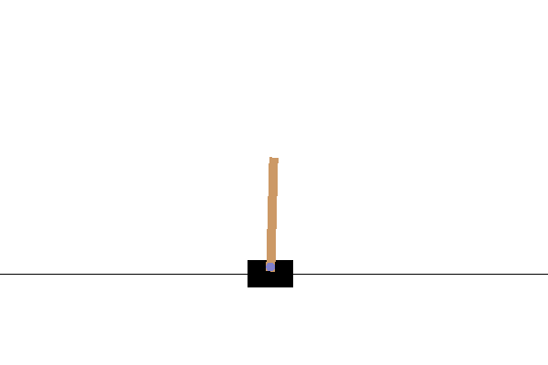
 | 
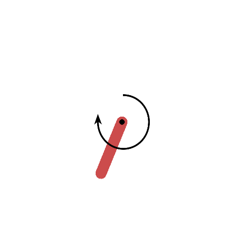
 | 
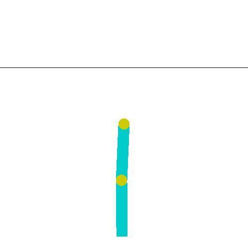
 | 
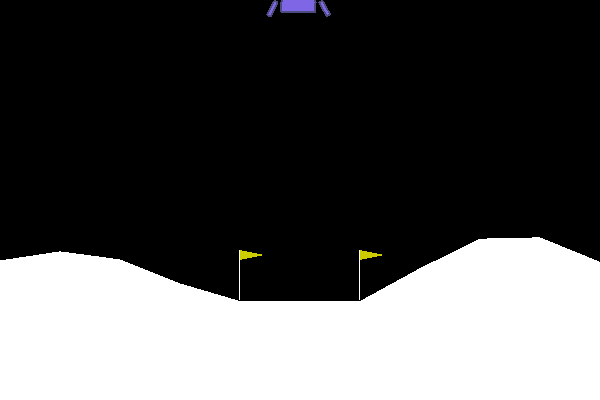
 |
| ------------------------------------------------------------ | ------------------------------------------------------------ | ------------------------------------------------------------ | ------------------------------------------------------------ |
| 
**Cartpole**
                       | 
**Pendulum**
                       | 
**Acrobat**
                        | 
**Lunar Lander Continuous**
        |

## A2C

**A2C** is a on-policy, model-free reinforcement learning algorithm. Here is the pseudo code for **A3C** which is almost similar to **A2C**.

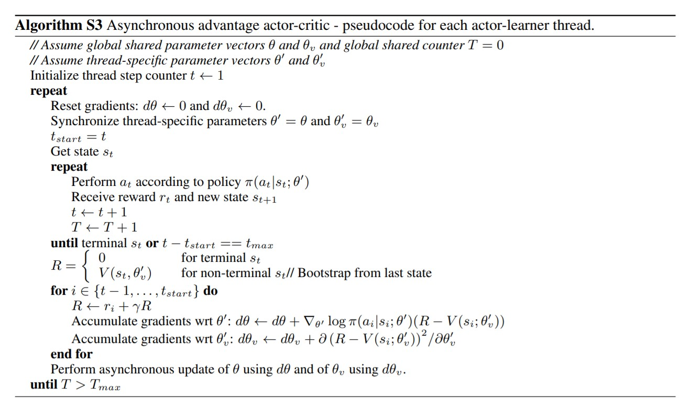

<table align='center'>
  <tr>
    <tb>

</tb>
  </tr>
   <tr>
       <tb>
Agent trained using A2C playing Acrobat game.
</tb>
  </tr>
</table>

## DDPG

**DDPG** is a off-policy, model-free reinforcement learning algorithm. Here is the pseudo code for **DDPG**

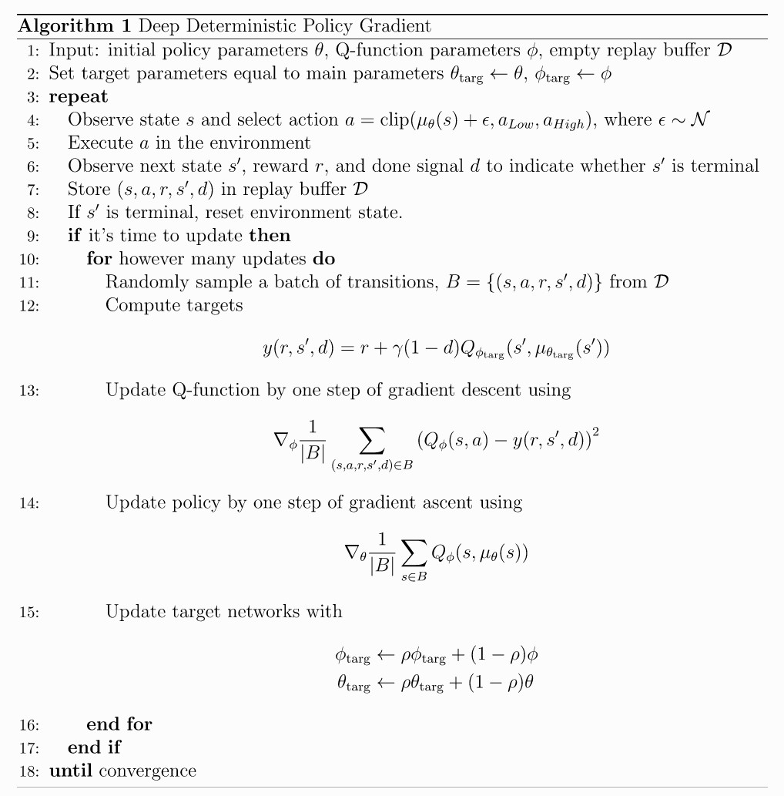

<table align='center'>
  <tr>
    <tb></tb>
    <tb></tb>
  </tr>
  <tr>
       <tb>
Agents trained using DDPG playing pendulum and lunar lander games.
</tb>
  </tr>
</table>

## Double DQN

**Double DQN** is a off-policy, model-free reinforcement learning algorithm. Here is the pseudo code for **Double DQN**

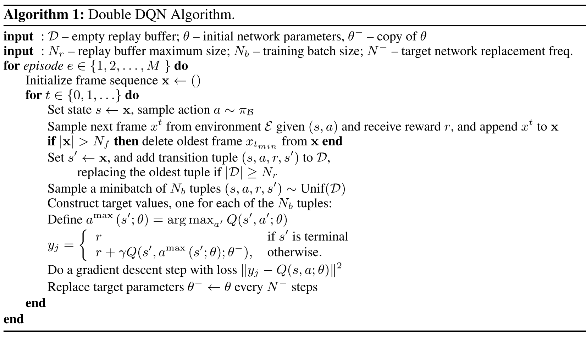

<table align='center'>
  <tr>
    <tb>
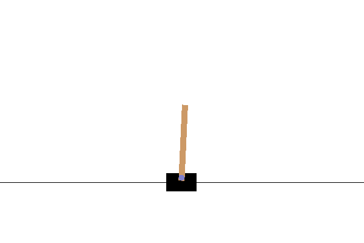
</tb>
  </tr>
   <tr>
       <tb>
Agent trained using Double DQN playing Cartpole game.
</tb>
  </tr>
</table>

## Dueling DQN

Similar to DDQN, dueling network contains two separate estimators: one for the state value function and one for the state-dependent action advantage function. 

Formula for the decomposition of Q-value:

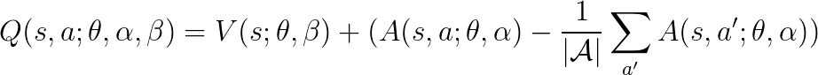

-  **θ** is shared parameter for the network.
- **α** parameterizes output stream for advantage function **Α**.
- **β** parameterizes output stream for value function **V**.

<table align='center'>
  <tr>
    <tb>
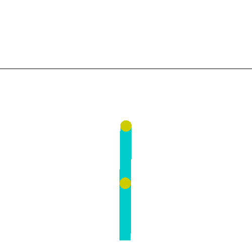
</tb>
  </tr>
   <tr>
       <tb>
Agent trained using Dueling DQN playing Acrobat game.
</tb>
  </tr>
</table>

## TD3

Here is the pseudo code for **TD3**

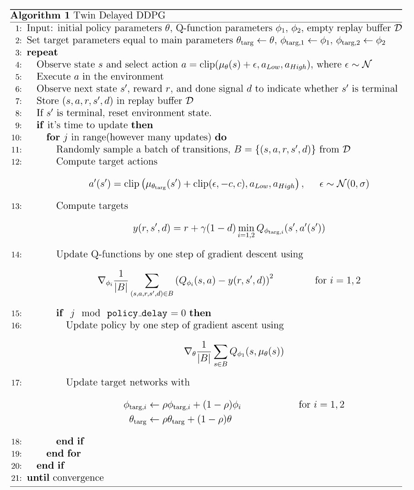

<table align='center'>
  <tr>
    <tb>
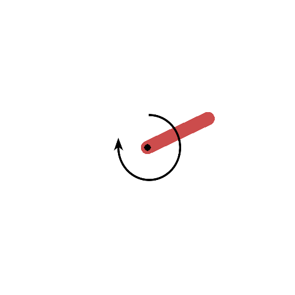
</tb>
  </tr>
   <tr>
       <tb>
Agent trained using TD3 playing Pendulum game.
</tb>
  </tr>
</table>

## References

* [Reinforcement Learning - Goal Oriented Intelligence](https://www.youtube.com/playlist?list=PLZbbT5o_s2xoWNVdDudn51XM8lOuZ_Njv)
* [Reinforcement Learning by Sentdex](https://www.youtube.com/playlist?list=PLQVvvaa0QuDezJFIOU5wDdfy4e9vdnx-7)
* [Wang et al., Dueling Network Architectures for Deep Reinforcement Learning](https://arxiv.org/pdf/1511.06581.pdf)
* [Dueling Deep Q Networks](https://towardsdatascience.com/dueling-deep-q-networks-81ffab672751)
* [Deriving Policy Gradients and Implementing REINFORCE](https://medium.com/@thechrisyoon/deriving-policy-gradients-and-implementing-reinforce-f887949bd63)
* [Understanding Actor Critic Methods and A2C](https://towardsdatascience.com/understanding-actor-critic-methods-931b97b6df3f)
* [Keras DDPG Example](https://keras.io/examples/rl/ddpg_pendulum/)

<small><a href="https://github.com/vstark21">&copy V I S H W A S</a></small>
